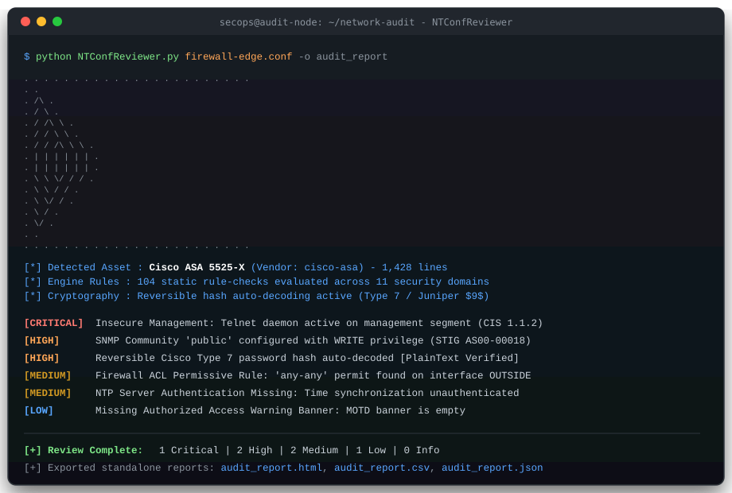
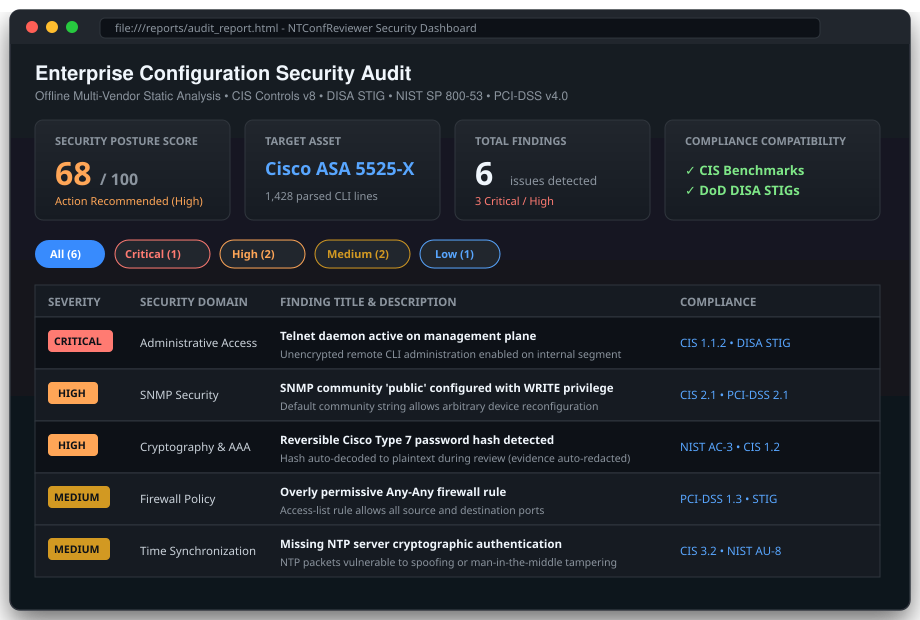

# NTConfReviewer

[-brightgreen.svg)](#features)

**NTConfReviewer** is an offline, zero-dependency static configuration security review engine for enterprise firewalls, switches, routers, and load balancers.

Built specifically for air-gapped enclaves, security operations centers (SOC), and compliance audits, NTConfReviewer analyzes raw network configuration files and fleet archives without sending data over the network or requiring external Python packages.

---

## Visual Previews

### CLI Terminal Execution

### Interactive HTML Security Report

---

## Key Capabilities

* **100% Offline & Standalone**: Requires only the Python standard library. No pip install, no internet access, and no third-party supply chain risk.
* **Deep Multi-Vendor Parsing**: Native heuristics and rule sets for 19 enterprise platforms (Cisco, Fortinet, Palo Alto, Juniper, Check Point, Arista, F5, and more).
* **Automated Credential Analysis**: Auto-detects and decodes reversible password hashes (Cisco Type 7 and Juniper $9$) and flags plaintext credentials.
* **Evidence Redaction**: Sensitive secret materials and decoded credentials are automatically masked in generated reports unless explicitly overridden via --show-passwords.
* **Cross-Framework Compliance**: Maps every finding directly to CIS Controls v8, DoD DISA STIGs, NIST SP 800-53 Rev 5 / 800-171, and PCI-DSS v4.0.
* **Multi-Format Reporting**: Generates self-contained interactive HTML dashboards, structured JSON for SIEM ingestion, flat CSV for spreadsheets, and colorized terminal summaries.
* **CI/CD Quality Gates**: Exit-code enforcement (--fail-on high) allows automated pipeline blocking for infrastructure-as-code and backup repositories.

---

## Quick Start

### 1. Audit a Single Configuration File
`Bash
python NTConfReviewer.py firewall.conf -o review_report
`
Generates 
eview_report.html, 
eview_report.csv, and 
eview_report.json.

### 2. Audit an Entire Fleet (Folder or Archive)
Scan a directory recursively or audit a .zip / .tar.gz bundle of device configs in a single command:
`ash
# Directory audit
python NTConfReviewer.py --dir ./network-backups --recursive -o fleet_audit

# Archive audit
python NTConfReviewer.py fleet_configs.zip -o fleet_audit
`

### 3. CI/CD Pipeline Quality Gate
Fail automated build pipelines if any finding at or above **High** severity is discovered:
`ash
python NTConfReviewer.py core-switch.cfg --fail-on high
`

### 4. Standalone Credential Decoder
Decode Cisco Type 7 or Juniper $9$ reversible hashes directly:
`ash
python NTConfReviewer.py --decode-password 0822455B0A
`

### 5. Built-in Verification & Self-Test
Verify all parser modules, detection heuristics, and decoding routines:
`ash
python NTConfReviewer.py --self-test
`

---

## Supported Platforms

| Platform Category | Vendor / OS | Supported Models & Formats |
|:---|:---|:---|
| **Firewalls & UTM** | **Fortinet FortiOS** | FortiGate 40F to 3000F, VM series (CLI backup / full conf) |
| | **Palo Alto PAN-OS** | PA-220 to PA-7000 series, VM, Panorama (XML & set format) |
| | **Cisco ASA / PIX / FWSM** | ASA 5505 to 5585-X, ASAv, Firepower running ASA code |
| | **Juniper Junos SRX** | SRX300, SRX1500, SRX4000, vSRX (hierarchical & set syntax) |
| | **Check Point Gaia** | R77, R80, R81 (clish CLI, objects.C, rulebases) |
| | **WatchGuard Fireware** | Firebox T-series, M-series, XML backup & CLI configs |
| **Routing & Switching** | **Cisco IOS / IOS-XE** | Catalyst 2960 to 9600, ISR 4000, ASR 1000 |
| | **Cisco NX-OS** | Nexus 2000, 3000, 5000, 7000, 9000 |
| | **Cisco IOS-XR** | ASR 9000, CRS, NCS 5500 |
| | **Arista EOS** | 7000 series switches, vEOS |
| | **Aruba / HPE** | ArubaOS-Switch, ProCurve, Provision, ArubaOS-CX |
| | **Brocade / Ruckus** | FastIron, ICX 6450 to 7850, ServerIron |
| | **Extreme Networks** | ExtremeXOS (Summit, BlackDiamond, Alpine) |
| | **Huawei VRP** | Quidway switches, Eudemon firewalls |
| **Application Delivery** | **F5 BIG-IP TMOS** | BIG-IP 2000 to 10000, iSeries, VIPRION (bigip.conf, tmsh) |
| **Legacy & EOL Assets** | **Juniper ScreenOS** | NetScreen-5GT, SSG-5, SSG-140, SSG-550 |
| | **Nokia IPSO** | IP390, IP560, IP1280, IP2450 |
| | **Dell PowerConnect** | PowerConnect 3500, 5500, 6200, 7000, 8100 |
| | **Alteon OS** | Alteon 180e, 184, 2208, 2424, 3408 |

---

## Audit Rule Domains

1. **Administrative Access & Management Plane**: SSH hardening, Telnet deactivation, HTTP/HTTPS management, session timeouts, management ACLs, and WAN access restrictions.
2. **Authentication, Authorization & Accounting (AAA)**: TACACS+/RADIUS authentication, local fallback security, password complexity, lockout policies, and console port protection.
3. **SNMP Security**: SNMPv1/v2c cleartext exposure, write access privileges, default community strings (public, private), and SNMPv3 encryption standards.
4. **Logging & SIEM Integration**: Syslog server definitions, log timestamps, buffer sizing, console logging levels, and traffic audit trail verification.
5. **Time Synchronization**: NTP server configurations, minimum server count, cryptographic NTP authentication, and timezone consistency.
6. **Warning Banners & Legal Notices**: Authorized access warnings, MOTD, login banners, and suppression of informational leaks.
7. **Insecure Services & Protocol Hygiene**: Deactivation of discovery protocols (CDP, LLDP), Proxy ARP, Directed Broadcast, Finger, PAD, and bootp.
8. **Firewall Policy & Access Lists**: Overly permissive ny-any permit rules, unlogged rules, broad port ranges, and rulebase hygiene.
9. **Threat Prevention & UTM**: Inspection profile enforcement (IPS, Antivirus, Anti-Spyware, URL Filtering, Application Control, and SSL Decryption).
10. **Cryptography & VPN Security**: Deprecated ciphers (DES, 3DES, RC4, MD5), weak Diffie-Hellman groups (< 14), and legacy TLS protocols (TLS 1.0 / 1.1).
11. **Switch & Layer 2 Security**: Spanning Tree BPDU Guard, Root Guard, Port Security, VLAN 1 operational usage, and trunk port hygiene.

---

## Command Line Reference

usage: NTConfReviewer.py [-h] [--dir DIR] [--recursive] [--vendor VENDOR]
                         [--model MODEL] [--no-absence-checks] [-o OUT]
                         [--format {all,html,csv,json}]
                         [--fail-on {critical,high,medium,low,info}]
                         [--decode-password DECODE_PASSWORD] [--show-passwords]
                         [--quiet] [--list-supported] [--self-test] [--version]
                         [config]

Options:
  config                 Single configuration file or ZIP/TAR/TGZ bundle
  --dir DIR              Directory containing network configuration files
  --recursive            Recurse through subdirectories
  --vendor VENDOR        Explicitly select vendor parser
  --model MODEL          Explicitly specify hardware/model tag
  -o OUT, --out OUT      Output file base name (generates .html, .csv, and/or .json)
  --format FORMAT        Report output format: all (default), html, csv, json
  --fail-on LEVEL        Exit with code 2 if findings at or above severity exist
  --decode-password HASH Decode Cisco Type 7 or Juniper $ password hash
  --show-passwords       Disable evidence redaction (reveal plaintext credentials)
  --quiet                Suppress console findings table
  --list-supported       Print comprehensive list of supported platforms and models
  --self-test            Run built-in multi-vendor test suite
  --version              Display version information

## License

This project is licensed under the [MIT License](LICENSE).
