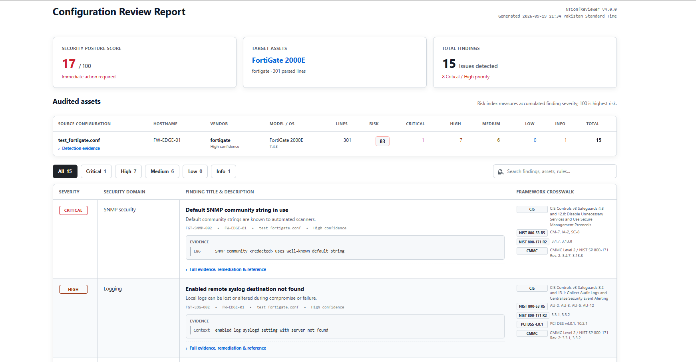
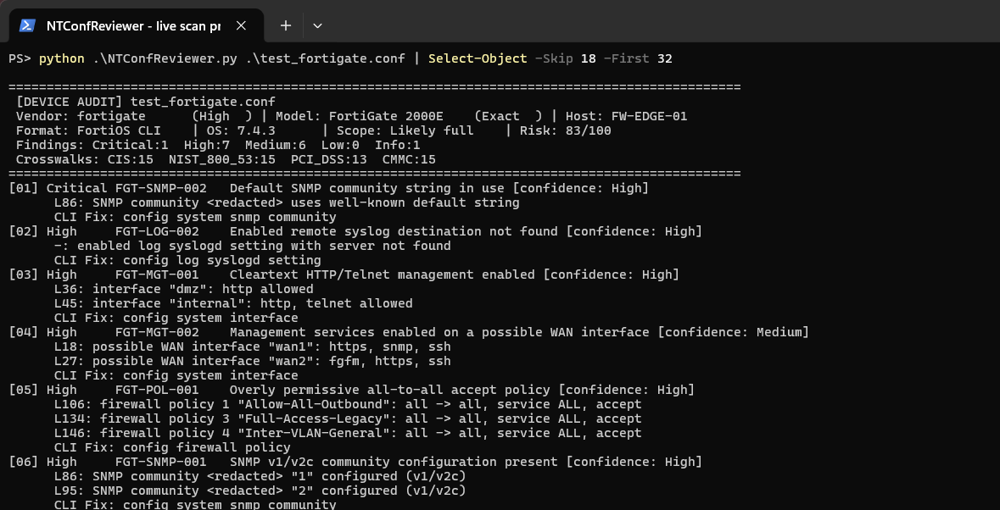

# NTConfReviewer

NTConfReviewer is a standalone Python script that checks network-device configuration files for common security issues. It runs locally and produces HTML, CSV, and JSON reports.

## Preview

### Report



### Terminal



## What it does

- Detects the vendor, model, hostname, and software version when present.
- Checks management access, authentication, SNMP, logging, NTP, firewall policies, VPN settings, cryptography, and switch security.
- Scans one configuration, a directory, or a ZIP/TAR archive.
- Redacts passwords and other secrets from evidence by default.
- Adds informational CIS, NIST, CMMC, and PCI DSS crosswalks where a mapping is supported.
- Supports severity-based exit codes for automation.

## Requirements

- Python 3.8 or newer
- No third-party packages

## Usage

Review one configuration:

```bash
python NTConfReviewer.py firewall.conf -o review_report
```

Review a directory or archive:

```bash
python NTConfReviewer.py --dir ./configs --recursive -o fleet_audit
python NTConfReviewer.py configs.zip -o fleet_audit
```

Fail when a high or critical finding is detected:

```bash
python NTConfReviewer.py firewall.conf --fail-on high
```

Run the built-in checks:

```bash
python NTConfReviewer.py --self-test
```

Use `python NTConfReviewer.py --help` for all options. Reports are written to the basename supplied with `-o`.

## Supported platforms

Cisco ASA/PIX/FWSM, IOS/IOS-XE, NX-OS and IOS-XR; FortiGate; Palo Alto PAN-OS; Juniper Junos and ScreenOS; Check Point; Arista; Aruba/HPE; Brocade/Ruckus; Extreme; F5 BIG-IP; WatchGuard; Huawei; Nokia IPSO; Dell PowerConnect; and Alteon OS.

## Note

This is a rule-based static review. Validate findings against the full configuration and device context before making changes, especially when reviewing partial exports.

## License

[MIT](LICENSE)
